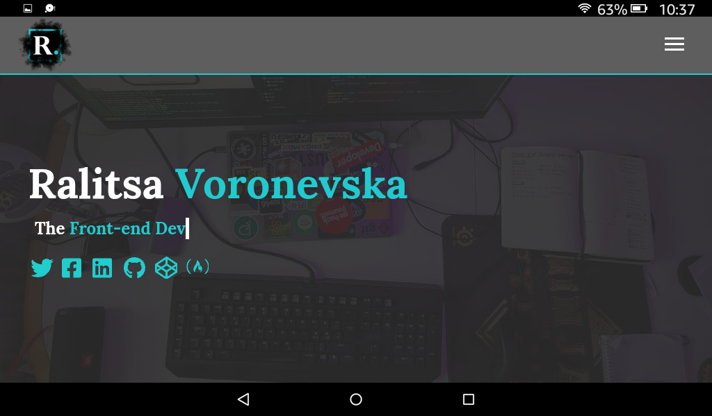
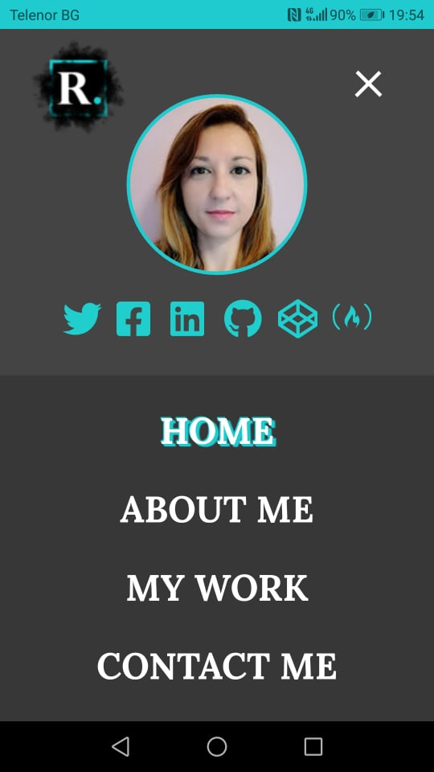
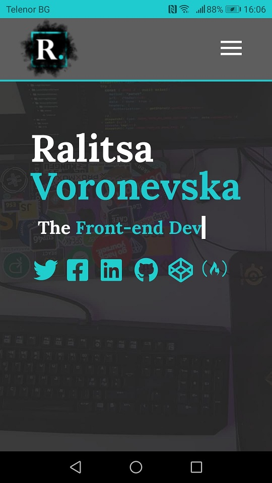

# Responsive Portfolio Website
[Live Preview](https://ralitsavoronevska.github.io/modern_portfolio/)

# Desktop Preview:

# Tablet Landscape Preview:

# Tablet Portrait Preview:

# Mobile Preview:

# Built with:
* HTML5, CSS3 (Grid template areas, Flex, transitions, etc.), SASS (mixins, etc.), Vanilla JS
* [Google Fonts](https://fonts.google.com/)
* [Font Awesome 5.9.0](https://fontawesome.com/changelog/latest)

# Browser support:
(Last updated and tested: 22/06/2020)
* Chrome 83.0.4103.116 (Official Build) (64-bit)
* Firefox 77.0.1 (64-bit)
* Opera 68.0.3618.173
* IE Microsoft Edge 83.0.478.56 (Official build) (64-bit)

# Tools used:
* Photoshop CC 2020
* [CSS filter generator to convert from black to target hex color [SVGs]](https://codepen.io/sosuke/pen/Pjoqqp)
* [W3C HTML Validator](https://validator.w3.org/)
* [W3C CSS Validator](https://jigsaw.w3.org/css-validator/)
* [LightHouse Audit](https://developers.google.com/web/tools/lighthouse/)
* [PageSpeed Insights Audit](https://developers.google.com/speed/pagespeed/insights/)

# Chrome LightHouse Audit

* Desktop & Mobile:

# PageSpeed Insights Results

* Desktop:

* Mobile:

# Resources used:

# Logo:
* [Smoke Logo Tutorial Article](http://dezcorb.com/how-to-create-a-smoke-logo-in-photoshop-cs6-smoke-alphabet-logo/)
* [Smoke Logo YouTube Tutorial](https://www.youtube.com/watch?time_continue=1&v=BuDmeErQXqQ)

# Traversy Media:
* [Responsive Portfolio Website Project YouTube Series Tutorial](https://www.youtube.com/watch?v=gYzHS-n2gqU&list=PLillGF-RfqbYoGoCjKoMOkVznV6aSXKzU)
* [Responsive Portfolio Website Project in GitHub](https://github.com/bradtraversy/modern_portfolio)
* [Pure JavaScript Type Writer Effect YouTube Tutorial](https://www.youtube.com/watch?v=POX3dT-pB4E)
* [Pure JavaScript Type Writer Effect Project in CodePen](https://codepen.io/bradtraversy/pen/jeNjwP)