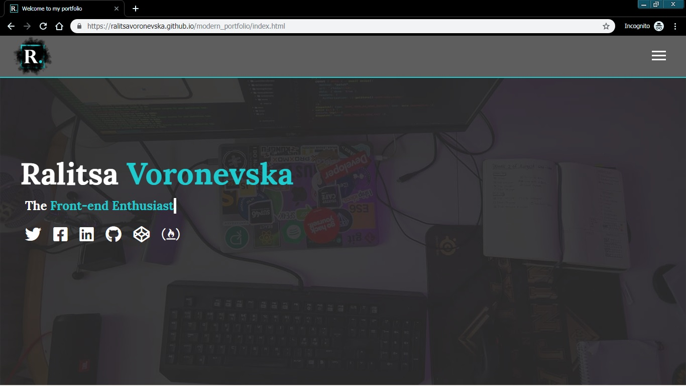
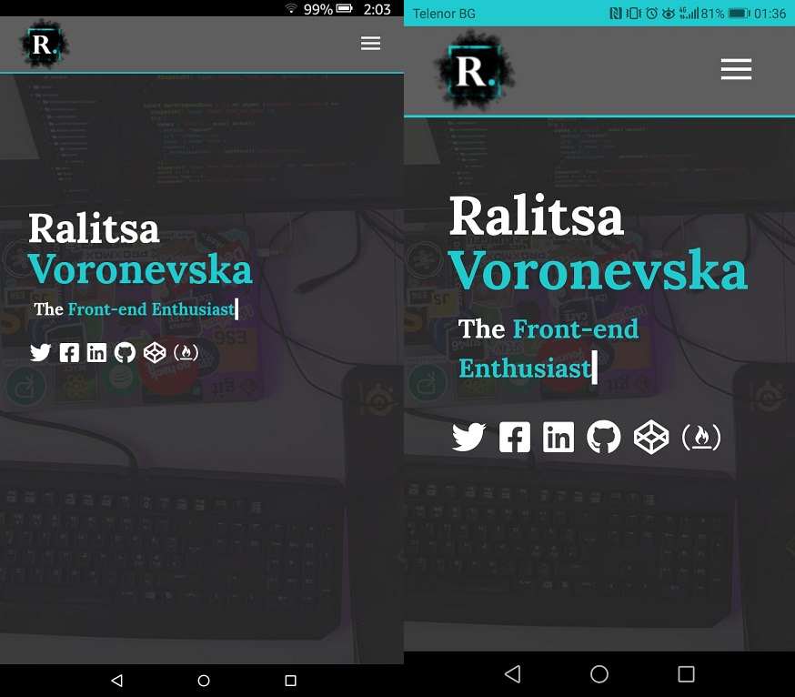
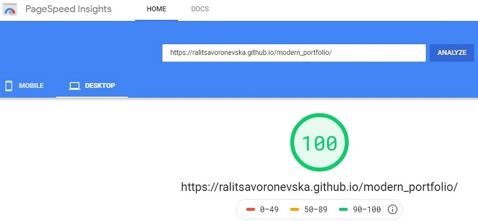

# Responsive Portfolio Website
[Live Preview](https://ralitsavoronevska.github.io/modern_portfolio/)

# Built with:
* HTML5, CSS3 (Grid template areas, Flex, transitions, etc.), SASS (mixins, etc.), Vanilla JS
* [Google Fonts](https://fonts.google.com/)
* [Font Awesome 5.9.0](https://fontawesome.com/changelog/latest)

# Browser support: 
(tested: 07/22/2019)
* Chrome 75.0.3770.142 (Official Build) (64-bit)
* Firefox 68.0 (64-bit)
* Opera 62.0.3331.72
* IE - no support for the moment 

# Chrome LightHouse Audit

* Desktop & Mobile:

# PageSpeed Insights Results

* Desktop:

* Mobile:

# Resources used:

# Logo:
* [Smoke Logo Tutorial Article](http://dezcorb.com/how-to-create-a-smoke-logo-in-photoshop-cs6-smoke-alphabet-logo/) 
* [Smoke Logo YouTube Tutorial](https://www.youtube.com/watch?time_continue=1&v=BuDmeErQXqQ) 

# Traversy Media:
* [Responsive Portfolio Website Project YouTube Series Tutorial](https://www.youtube.com/watch?v=gYzHS-n2gqU&list=PLillGF-RfqbYoGoCjKoMOkVznV6aSXKzU) 
* [Responsive Portfolio Website Project in GitHub](https://github.com/bradtraversy/modern_portfolio)
* [Pure JavaScript Type Writer Effect YouTube Tutorial](https://www.youtube.com/watch?v=POX3dT-pB4E)
* [Pure JavaScript Type Writer Effect Project in CodePen](https://codepen.io/bradtraversy/pen/jeNjwP)
